>   **Chapter 4 exercise – performing an initial Windows Server configuration**

>   In this chapter exercise, you will learn how to do the following:

>   Perform Windows Server initial configuration using Server Manager

>   Perform Windows Server initial configuration using Server Configuration

Performing Windows Server initial configuration using Server Manager
--------------------------------------------------------------------

>   The following section provides explanations regarding the initial
>   configuration of Windows Server 2019 Standard (Desktop Experience) by using
>   Server Manager.

1.  From Hyper-V Manager, start Svr2 and connect to it. Accept location and
    keyboard or change if necessary.

2.  Type password Pa55w.rd twice.

### Changing the server name

>   To change the server name as in *Figure 4.28*, take the following steps:

1.  In Server Manager, in the **Properties** section, click the highlighted
    default computer name.

2.  In the **System Properties** window, click the **Change** button.

3.  In the **Computer Name/Domain Changes** window, delete the existing computer
    name and provide the name for your server, and then click **OK**:

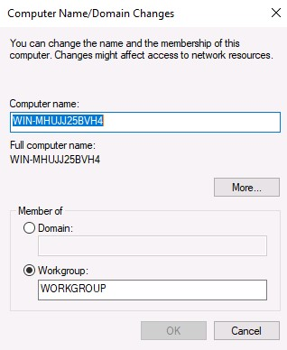

1.  Click **OK** to confirm that you will restart your server to apply these
    changes.

2.  In the **System Properties** window, click the **Close** button.

3.  In the Microsoft Windows dialog box, click **Restart Now**.

>   Now let's learn how to join the server to a domain.

### Joining a domain

>   Before joining the server to a domain, evaluate the role of your server. If
>   your server is going to be a **Domain Controller** (**DC**), then there is
>   no need for it to join a domain, as adding the AD DS role will automatically
>   make your server a domain controller. Otherwise, if your server is going to
>   have a role other than AD DS, then, as a domain member, it must join the
>   domain as in *Figure 4.29*. To do so, take the following steps:

1.  In the **Properties** section, click the highlighted workgroup.

2.  In the **System Properties** window, click the **Change** button.

3.  In the **Computer Name/Domain Changes** window, select the **Domain:**
    option and click the textbox to provide the domain name: myorg.local, and
    then click **OK**:

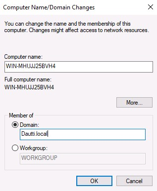

>   Figure 4.29: Joining a server to a domain

1.  In the **Windows Security** window, enter the name and password of an
    account with a permission to join the domain, and then click **OK**.

2.  The **Computer Name/Domain Changes** dialog box welcomes your server to your
    organization's domain. Click **OK** to close it.

3.  Click **OK** to confirm that you will restart your server to apply these
    changes.

4.  In the **System Properties** window, click the **Close** button.

5.  In the **Microsoft Windows** dialog box, click **Restart Now**.

>   Now let's learn how to enable Remote Desktop.

### Enabling Remote Desktop

>   To enable Remote Desktop, as in *Figure 4.30*, take the following steps:

1.  In the **Properties** section, click the highlighted Remote Desktop setting.

2.  In the **System Properties** window, select the **Allow remote connections
    to this computer** option.

3.  The **Remote Desktop Connection** dialog box informs you that the Remote
    Desktop firewall exception will be enabled. Click **OK** to close it:

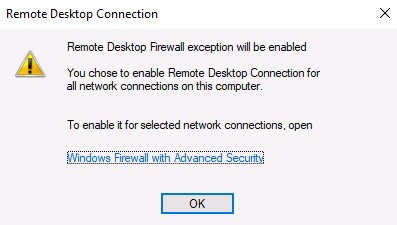

1.  To add Remote Desktop users, click the **Select Users...** button.

2.  In the **Remote Desktop Users** window, click the **Add** button to add
    users. Select “Domain Users” from your AD DS. When you have finished adding
    Remote Desktop users, click **OK** to close the **Remote Desktop Users**
    window.

3.  Again, click **OK** to close the **System Properties** window.

>   Now let's learn how to set up the IP address.

### Setting up the IP address

>   To set up the IP address, as in *Figure 4.31*, take the following steps:

1.  In the **Properties** section, click the highlighted Ethernet setting:

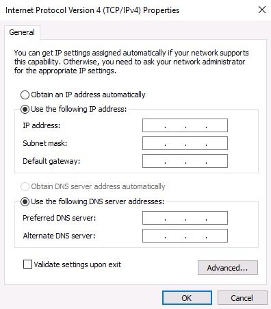

1.  In the **Network Connections** window, right-click your server's Ethernet
    and select **Properties**.

2.  In the **Ethernet Properties** window, select **Internet Protocol Version 4
    (TCP/IPv4),** and click the **Properties** button.

3.  In the **Internet Protocol Version 4 (TCP/IPv4) Properties** window, select
    the **Use the following IP address:** option and enter the **IP address**,
    **Subnet mask**, and **Default gateway** fields.

4.  IP Address: 172.16.0.12  
    Subnet Mask: 255.255.0.0  
    Default Gateway: 172.16.0.1

>   DNS Server: 172.16.0.10

1.  Additionally, select the **Use the following DNS server addresses:** option
    and fill in the **Preferred DNS server** and **Alternate DNS server**
    fields. Click **OK** to close.

2.  Click the **Close** button to close the **Ethernet Properties** window.

3.  In the upper-right corner, click the Close button (the red X) to close the
    **Network Connections** window.

>   Now let's learn how to turn off the IE enhanced security settings.

### Turning off IE enhanced security

>   To turn off the IE enhanced security settings, as in *Figure 4.33*, take the
>   following steps:

1.  In the **Properties** section, click the highlighted IE enhanced security
    configuration setting.

2.  In the **Internet Explorer Enhanced Security Configuration** window within
    the **Administrators:** section, select the **Off** option.

3.  Click **OK** to close the **Internet Explorer Enhanced Security
    Configuration** window:

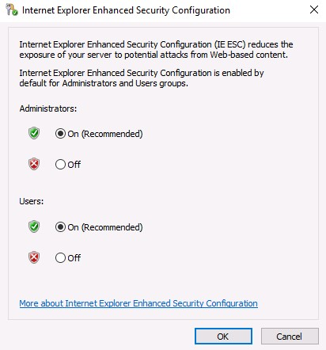

>   Figure 4.33: Turning off IE enhanced security

>   Now let's learn how to change the time zone.

### Changing the time zone

>   To change the time zone, as in *Figure 4.34*, take the following steps:

1.  In the **Properties** section, click the highlighted time zone setting.

2.  In the **Date and Time** window, click the **Change time zone...** button.

3.  In the **Time Zone Settings** window, click the drop-down list to select
    your time zone.

4.  Click **OK** to close the **Time Zone Settings** window.

5.  Again, click **OK** to close the **Date and Time** window:

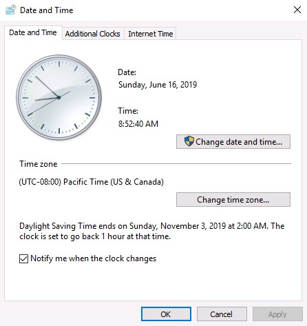

Performing Windows Server initial configuration using Server Configuration
--------------------------------------------------------------------------

>   The following section explains the initial configuration of Windows Server
>   2019 Standard (Server Core) using Server Configuration.

1.  Start SVR3 and sign in.

### Changing the server name

>   To change the server name, as in *Figure 4.36*, take the following steps:

1.  Enter 2 as a selected option and press *Enter*.

2.  Enter the new server name, SVR3 and press *Enter*.

3.  In the **Restart** dialog box, click **Yes** to restart the server:

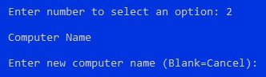

>   Figure 4.36: Changing the server name

1.  Your server will restart so it can apply the server name change.

>   Now let's learn how to join the server to a domain.

### Joining the domain

>   Before joining the domain, take into consideration the notes provided
>   earlier, when we were performing configuration using Server Manager. To join
>   the domain, as in *Figure 4.37*, take the following steps:

1.  Enter 1 as a selected option and press *Enter*.

2.  To join your server to your organization domain, enter D and press *Enter*.

3.  Enter your organization domain, myorg.local, and press *Enter*.

4.  Enter the authorized domain user and press *Enter*.

5.  Enter the password and press *Enter*.

6.  In the **Change Computer Name** dialog box, click **No** when asked to
    change the name of your server:

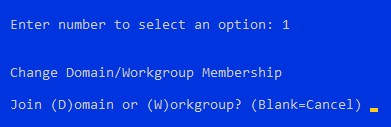

>   Figure 4.37: Joining the domain

>   Now let's learn how to enable Remote Desktop.

### Enabling Remote Desktop

>   To enable Remote Desktop, as in *Figure 4.38*, take the following steps:

1.  Enter 7 as a selected option and press *Enter*.

2.  To enable Remote Desktop, enter E and press *Enter*.

3.  Enter 1 and press *Enter* for more secure access.

4.  In the **Remote Desktop** dialog box, click **OK** to confirm Remote Desktop
    enabling:

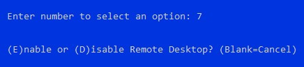

>   Now let's learn how to set up the IP address.

### Setting up the IP address

>   To set up the IP address, as in *Figure 4.39*, take the following steps:

1.  Enter 8 as a selected option and press *Enter*.

2.  Enter the number of the network adapter that you want to set up the IP
    address for and press *Enter*.

3.  Enter 1 in the sub-menu to set the network adapter address and press
    *Enter*.

4.  Enter S for the static IP address and press *Enter*.

5.  Enter the static IP address 172.16.0.13 and press *Enter*.

6.  Enter the subnet mask 255.255.0.0 and press *Enter*.

7.  Enter the default gateway 172.16.0.1 and press *Enter*.

8.  Enter 2 in the sub-menu to set the DNS servers and press *Enter*.

9.  Enter the new preferred DNS server 172.16.0.10 and press *Enter*.

10. In the **Network Settings** dialog box, click **OK** to close it.

11. Enter the alternate DNS server and press *Enter*.

12. Enter 4 in the sub-menu to exit and **Return to Main Menu**:

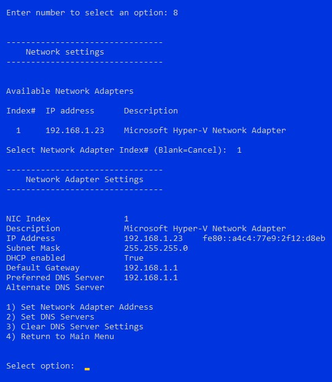

>   Figure 4.39: Setting up the IP address

>   Now let's learn how to change the time zone.

### Changing the time zone

>   To change the time zone, as in *Figure 4.41*, take the following steps:

1.  Enter 9 as a selected option and press *Enter*.

2.  In the **Date and Time** window, click the **Change time zone...** button.

3.  In the **Time Zone Settings** window, click the drop-down list to select
    your time zone.

4.  Click **OK** to close the **Time Zone Settings** window.

5.  Again, click **OK** to close the **Date and Time** window:

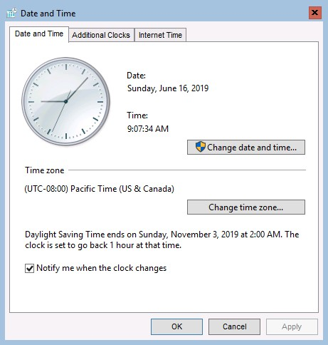
