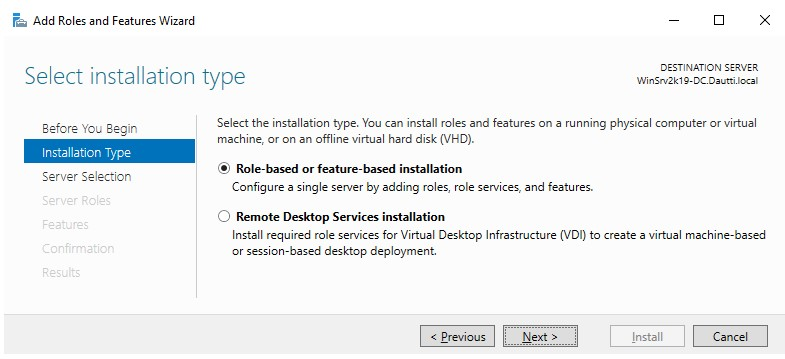
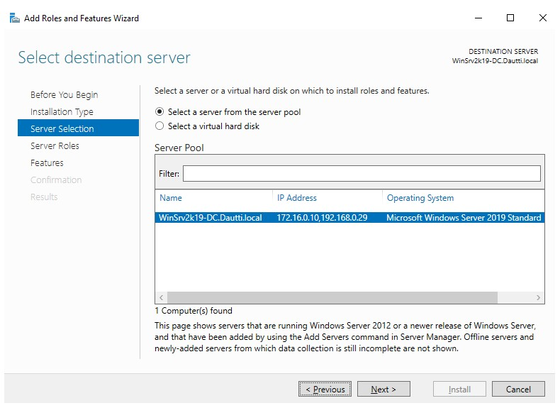

>   **Chapter 6 exercise – installing web server (IIS) and PDS roles**

>   In this chapter exercise, you will learn how to do the following:

>   How to install a web server (IIS) role

>   How to install a PDS role

Installing the web server (IIS) role
------------------------------------

>   To install the web server (IIS) role in Windows Server 2019, complete the
>   following steps:

1.  Click the **Start** button and then, in the **Start** menu, click on
    **Server Manager**.

2.  In the Server Manager window, click on the **Add roles and features**
    hyperlink.

3.  Shortly, the **Add Roles and Features Wizard** will open, as shown in
    *Figure 6.31*:

1.  Accept the **Role-based or feature-based installation** option and click the
    **Next** button.

2.  Ensure that the right server is highlighted from the server pool, then
    accept the **Select a server from the server pool** option and click
    **Next**.

3.  From the list of the roles, select the **Web Server (IIS)** role.

4.  Click the **Add Features** button when the **Add features that are required
    for Web Server (IIS)?** popup appears.

5.  There is no feature required for adding the web server (IIS) role at this
    stage, so just click the **Next** button.

6.  In the web server (IIS) definition and the things to note regarding web
    server (IIS) installation, click **Next** to proceed.

7.  Either accept the web server (IIS) role services or customize them to your
    needs.

8.  Confirm installation selections for the web server (IIS) role by clicking
    the **Install** button.

9.  When installation progress reaches the end, click the **Close** button to
    close the *Add Roles and Features Wizard*.

10. A server restart is not required.

>   The web server (IIS) role will now get installed.

Installing a PDS role
---------------------

>   To install a PDS role in Windows Server 2019, complete the following steps:

1.  Click the **Start** button and then, in the **Start** menu, click on
    **Server Manager**.

2.  In the Server Manager window, click on the **Add roles and features**
    hyperlink.

3.  Shortly, the **Add Roles and Features Wizard** will open.

4.  Accept the **Role-based or feature-based installation** option and click the
    **Next** button.

5.  Ensure that the right server is highlighted from the server pool, and then
    accept the **Select a server from the server pool** option and click
    **Next** (see *Figure 6.32*):

1.  From the list of the roles, select the **Print and Document Services** role.

2.  Click the **Add Features** button when the **Add features that are required
    for Print and Document Services?** dialog pops up.

3.  There is no feature required for adding PDS role at this stage, so just
    click the **Next** button.

4.  In the PDS definition and the things to note regarding PDS installation,
    click **Next** to proceed.

5.  Either accept the PDS role services or customize it to your needs.

6.  Confirm the installation selections for the PDS role by clicking the
    **Install** button.

7.  When installation progress reaches the end, click the **Close** button to
    close the **Add Roles and Features Wizard**.

8.  A server restart is not required.

>   The PDS role will now get installed.
