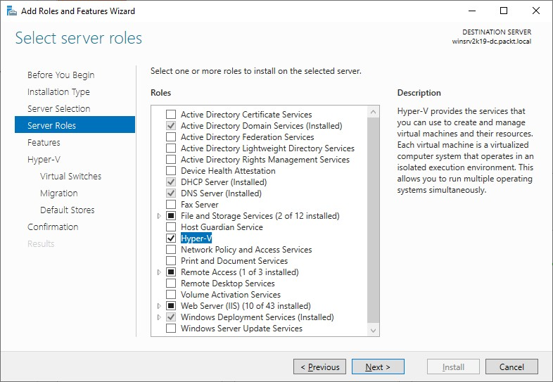
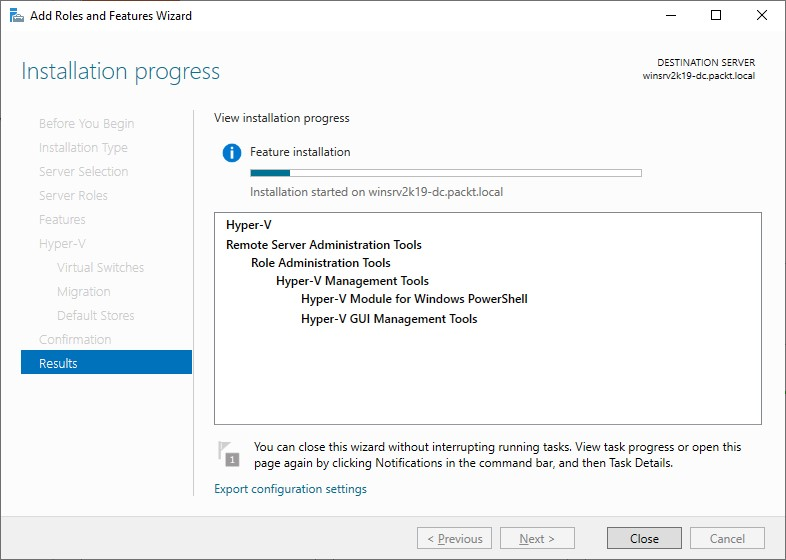

>   **Chapter 8 exercise – installing Hyper-V on Windows Server 2019**

>   In this exercise, you will learn how to install the Hyper-V role on Windows
>   Server 2019.

Prepare for Nested Virtualization.
----------------------------------

1.  In Hyper-V Manager, right click SVR1, choose Settings, and then, under
    Hardware, click “Memory” and remove “Enable Dynamic Memory”.

2.  Open an administrative PowerShell prompt by right clicking the Windows
    button on the host machine and choose “Windows PowerShell (Admin).

3.  In the PowerShell prompt, write in one command: Set-VMProcessor -VMName SVR1  
    -ExposeVirtualizationExtensions \$true.

4.  Start SVR1.

5.  Signin to SVR1 with myorg\\administrator and Pa55w.rd

Installing the Hyper-V role on Windows Server 2019
--------------------------------------------------

>   To install the Hyper-V role on Windows Server 2019 using the Server Manager,
>   complete the following steps:

1.  Click the Start button, and then, in the Start menu, click **Server
    Manager**.

2.  In the **Server Manager** window, click the **Add roles and features**
    hyperlink.

3.  In the **Before You Begin** option, click **Next**.

4.  In the **Installation Type** option, click **Next**.

5.  In the **Server Selection** option, click **Next**.

6.  Select the **Hyper-V** role, as shown in *Figure 8.17*:

1.  Click the **Add Features** button to add features that are required for
    Hyper-V.

2.  There is no feature to add, so click **Next**.

3.  In the Hyper-V definition option, click **Next**.

4.  Select the available network adapter, and then click **Next**.

5.  Select **Allow this server to send and receive live migrations of virtual
    machines** and click **Next**.

6.  Set up the path where you will store the VMs and click **Next**.

7.  Confirm the installation selections for the Hyper-V role by clicking
    **Install**.

8.  When the installation process completes, click **Close** (see *Figure
    8.18*). The server will restart automatically:

>   The Hyper-V role will now be installed and is ready to use.

1.  After restart, sign in and open Hyper-V Manager.

2.  Rightclick SVR1 and choose Import Virtual Machine.

3.  Click Next, and then click Browse. Scroll down to the C: drive, doubleclick
    the folder export, then click on the folder SVR2 and then click Select
    Folder. The path should read “C:\\export\\SVR2”.

4.  Click Next 3 times.

5.  Change Startup RAM to 1024. This is due to limited resources in this lab
    setup.

6.  Click Next 3 times while ignoring the errors. In real life, the Virtual
    switches should match those on the Hyper-V host that we export from.

7.  Clcik Finish

8.  If time permits, start the virtual machine to see that it’s functional. It
    may be slow due to the limited RAM available
