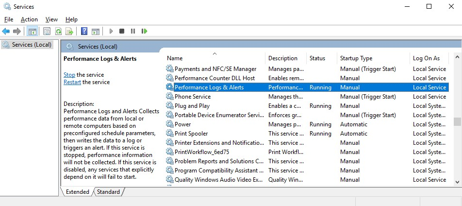
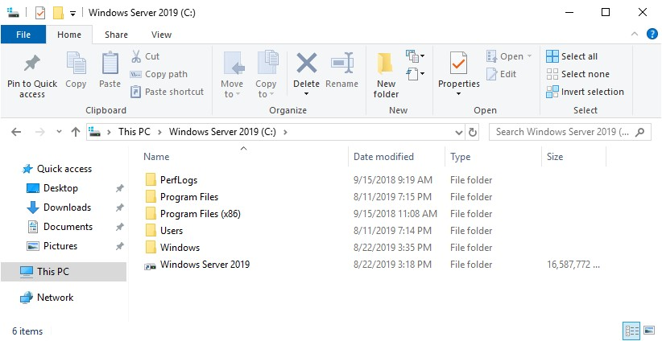
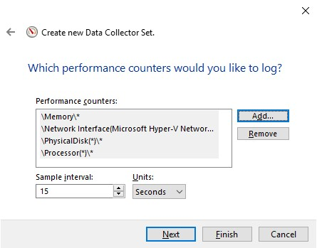
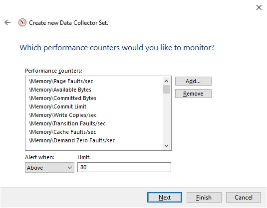

>   **Chapter 10 exercise – the performance logs and alerts service**

>   In this exercise, you will learn how to do the following:

>   Start the performance logs and alerts service

>   Access the Performance Monitor logs folder

>   Create performance data logs

>   Set up performance counter alerts

Starting the performance logs and alerts service
------------------------------------------------

>   To start the performance logs and alerts service in Windows Server 2019,
>   complete the following steps:

1.  Press the Windows key + *R*.

2.  Enter services.msc and press *Enter*.

3.  From the list of services, locate the **Performance Logs & Alerts** (see
    *Figure 10.14*) service to check its status.

4.  If it is stopped, then right-click and select **Start**.

5.  Close the **Services** window:

>   Now that we have started the performance logs and alerts service, let's move
>   to our next task of accessing the Performance Monitor logs folder.

Accessing the Performance Monitor logs folder
---------------------------------------------

>   To access the Performance Monitor logs folder, PerfLogs, in Windows Server
>   2019, complete the following steps:

1.  Press the Windows key + *R*.

2.  Enter C: and press *Enter.*

3.  The PerfLogs folder appears, as shown in *Figure 10.15*:

>   Moving forward, let's now create some performance data logs.

Creating performance data logs
------------------------------

>   To create performance data logs in Windows Server 2019, complete the
>   following steps:

1.  With **Performance Monitor** open, expand **Data Collector Sets** and select
    **User Defined**.

2.  Right-click **User Defined** and select **New** \| **Data Collector Set**.

3.  Enter the name for your Data Collector Set.

4.  Choose the **Create manually (Advanced)** option and then click **Next**.

5.  Choose the **Create data logs** option and the **Performance counter**
    sub-option, and then click **Next**.

6.  Click the **Add** button to add counters, as shown in *Figure 10.16*,
    specify the time interval, and then click **Next**:

1.  Check that the default folder for saving data logs is the PerfLogs folder,
    and then click **Next**.

2.  Set the user in **Run as**, and select the **Start this data collector set
    now** option.

3.  Click **Finish**.

>   Finally, let's now set up performance counter alerts.

Setting up performance counter alerts
-------------------------------------

>   To set up a performance counter alert in Windows Server 2019, complete the
>   following steps:

1.  Repeat *steps 1* to *4* from the *Creating performance data logs* section.

2.  Choose **Performance Counter Alert**, and then click **Next**.

3.  Click the **Add** button to add counters, as shown in *Figure 10.17*,
    specify an alert limit, and then click **Next**:

1.  Set the user in **Run as**, and select the **Start this data collector set
    now** option.

2.  Click **Finish**.

>   This was a nice exercise as it covered various examples of performance logs
>   and alerts in Windows Server 2019.
