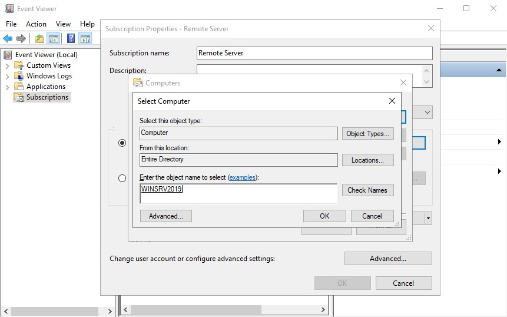
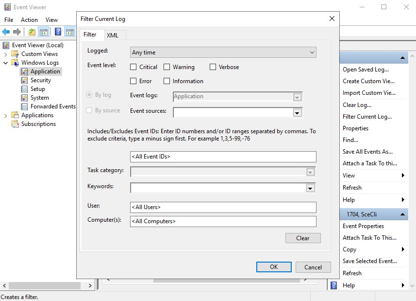

>   **Chapter 11 exercise – using Event Viewer to monitor and manage logs**

>   In this exercise, you will learn how to do the following:

>   Set up centralized monitoring

>   Filter Event Viewer logs

>   Change the default logs location

Setting up centralized monitoring
---------------------------------

>   To set up centralized monitoring in Windows Server 2019, complete the
>   following steps:

1.  On DC1*,* open the **Command Prompt** with elevated admin rights, enter
    winrm quickconfig, and then press *Enter*.

2.  In Server Manager, click Tools and then click Active Directory Users and
    Computers..

3.  In the domain, doubleclick the Builtin container.

4.  Open the administrators group and add SVR1.

5.  On **SVR1***,* open **Command Prompt** with elevated admin rights, enter
    wecutil qc, and then press *Enter*.

6.  Press **Y** (for yes) when prompted to do so.

7.  From the **Command Prompt** window, enter eventvwr.exe to open **Event
    Viewer**.

8.  Right-click on **Subscriptions** and select **Create Subscription...**.

9.  Enter the **Subscription name** and its **Description**.

10. Select **Forwarded Events** as **Destination log***.*

11. Select **DC1** by clicking on the **Select Computers...** button, as shown
    in *Figure 11.20,* and then click on **OK**:

1.  In the **Subscription Properties** window, click on the **Select Events...**
    button, and select **Edit**.

2.  In the **Query Filter** window, set the event logs filtering criteria that
    you want to collect and click on **OK**.

3.  Click on the **Advanced...** button to make sure that the machine account is
    the chosen option, and then click on **OK**.

4.  Click on **OK** to close the **Subscription Properties** window.

>   Now that we have set up centralized monitoring, let's filter Event Viewer
>   logs.

Filtering Event Viewer logs
---------------------------

>   To filter the Event Viewer logs in Windows Server 2019, complete the
>   following steps:

1.  Press the Windows key + *R*, enter eventvwr.msc, and then press *Enter*.

2.  Expand **Windows Logs** and select the log type that you want to filter.

3.  In the **Actions** pane, click on **Filter Current Log...**, as shown in
    *Figure 11.21*:

>   Figure 11.21: Filtering Event Viewer logs

1.  In the **Filter Current Log** window, set the filtering criteria to get the
    desired results.

2.  Click on **OK** to close the **Filter Current Log** window.
