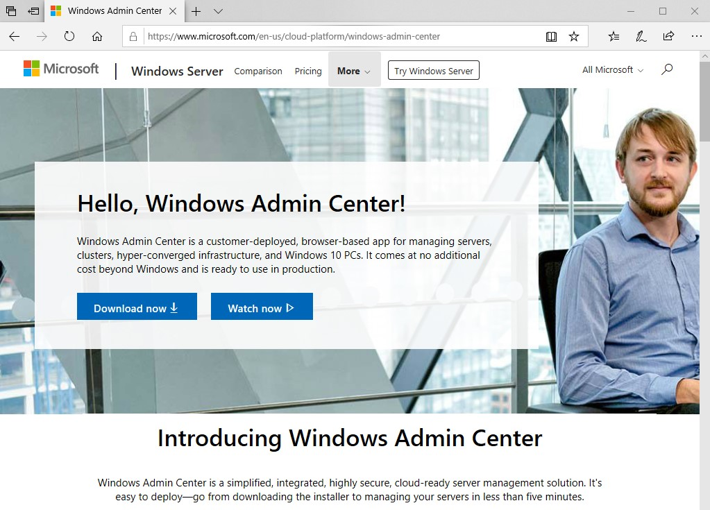

>   **Chapter 2 exercise – downloading Windows Admin Center**

>   In this chapter exercise, you will learn how to download Windows Admin
>   Center.

Downloading Windows Admin Center
--------------------------------

>   To download Windows Admin Center for your Windows 10 computer, complete the
>   following steps:

1.  Open up the browser and go to
    [https://](https://www.microsoft.com/en-us/cloud-platform/windows-admin-center)​
    [www](https://www.microsoft.com/en-us/cloud-platform/windows-admin-center)​[.microsoft](https://www.microsoft.com/en-us/cloud-platform/windows-admin-center)​.com​[/](https://www.microsoft.com/en-us/cloud-platform/windows-admin-center)​[en-us](https://www.microsoft.com/en-us/cloud-platform/windows-admin-center)​[/cloud](https://www.microsoft.com/en-us/cloud-platform/windows-admin-center)-[platform/windows](https://www.microsoft.com/en-us/cloud-platform/windows-admin-center)​[-admin](https://www.microsoft.com/en-us/cloud-platform/windows-admin-center)​[-cente](https://www.microsoft.com/en-us/cloud-platform/windows-admin-center)​[r](https://www.microsoft.com/en-us/cloud-platform/windows-admin-center).

2.  On the Windows Admin Center download site, click the **Download now**
    button, as shown in *Figure 2.9*:

1.  The Windows Admin Center will start downloading.

2.  Run the install file after download, and install it with default settings.
    On the 3rd page, enable “Create a desktop shortcut” and then click
    “Install”. Before clicking Finish, make sure you enable “Open Windows Admin
    Center”.

3.  When Windows Admin Center opens, sign in with Administrator and Pa55w.rd If
    necessary, and take a look around.
