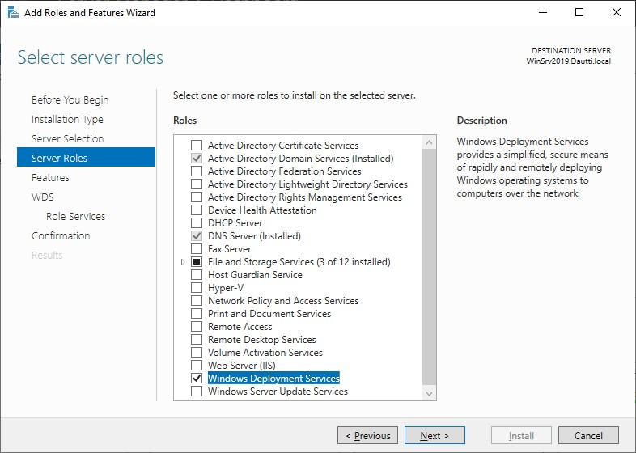
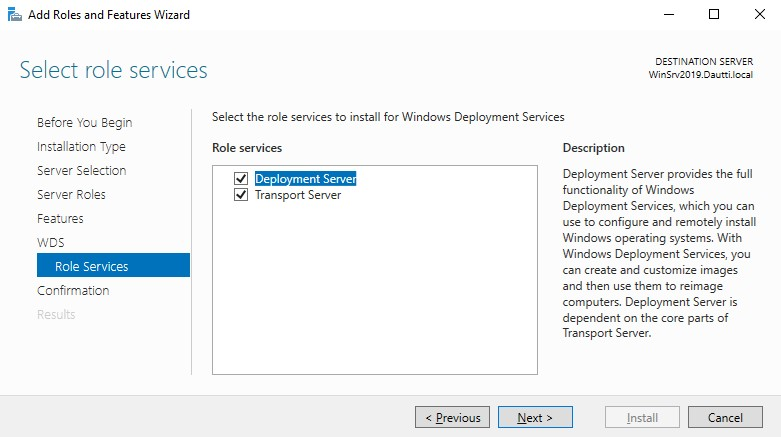
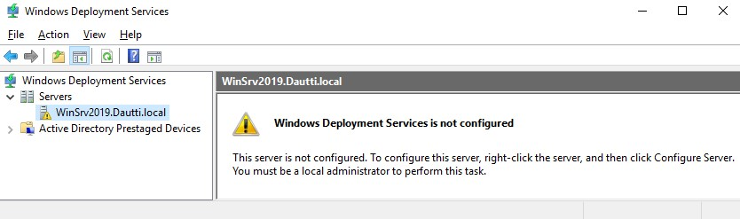
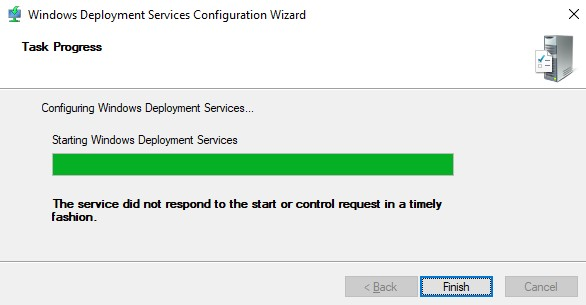
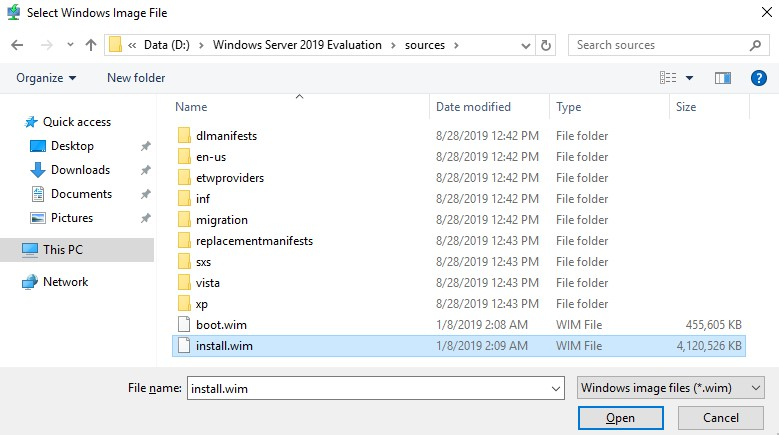
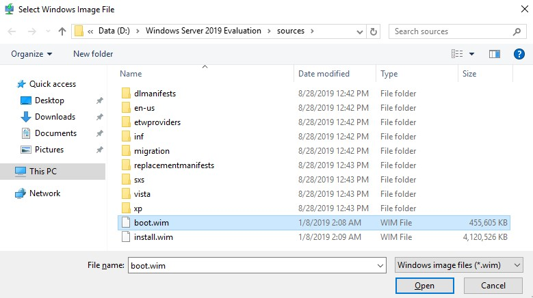
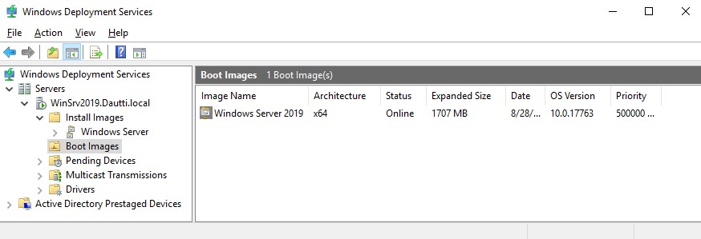

>   **Chapter 3 exercise – setting up WDS**

>   In this exercise, you will learn how to do the following:

>   Installing WDS Setting up WDS

Installing WDS
--------------

>   To install WDS in Windows Server 2019, complete the following steps:

1.  In Server Manager, click Tools and then click “Hyper-V Manager.

2.  Select DC1 and SVR1 and start both.

3.  When started, select SVR1 and click “Connect”. When possible, sign in as
    myorg\\administrator and Pa55w.rd

4.  In the Virtual Meachine Connection window, click “Media in the top menu,
    then DVD Drive, then “Insert Disk”. Choose the path
    “C:\\iso\\xxxx_SERVER_EVAL_XXXX.iso.”

5.  In the **Server Manager** window, in the **WELCOME TO SERVER MANAGER**
    section, click **Add roles and features**.

6.  With the **Add Roles and Features Wizard** open, click **Next**.

7.  Select the **Role-based or feature-based installation** option and click
    **Next**.

8.  With the **Select a server from the server pool** option checked, click
    **Next**.

9.  Select the Windows Deployment Services role, as shown in Figure 3.34, and
    then click Next:

1.  Accept the default settings in the **Select features** step, and then click
    **Next**.

2.  Take your time to read the WDS description and the things to note regarding
    the WDS installation. Then, click **Next**.

3.  Select **Role Services** and then click **Next**, as shown in *Figure 3.35*:

1.  Confirm the installation selections for the WDS role, and click the
    **Install** button.

2.  Either hit **Close** or wait until the installation progress reaches its
    end.

3.  Click **Close** to close the **Add Roles and Features Wizard***.*

>   We have successfully installed WDS. Now it is time to set it up.

Setting up WDS
--------------

>   To set up WDS in your Windows Server 2019 server, complete the following
>   steps:

1.  Click the Start button, and then on the Start menu, click **Windows
    Administrative Tools**.

2.  From the list, double-click the **Windows Deployment Services**. Shortly
    afterward, the **Windows Deployment Services** console will open, as shown
    in *Figure 3.36*:

1.  In the WDS window, right-click the server, and then from the context menu,
    select **Configure Server**.

2.  In the **Windows Deployment Services Configuration Wizard**, read the
    **Before you begin** message and then click **Next**.

3.  In the **Install Options** step, select the **Integrated with Active
    Directory** option and then click **Next**.

4.  **Remote Installation Folder Location** step, accept default and then click
    **Next**.

5.  In the **Proxy DHCP Server** step, click **Next**.

6.  In the **PXE Server Initial Settings** step, select “Respond to all client
    computers” and then click **Next**.

7.  In the **Task Progress** step, wait for the task to be completed and then
    click **Finish** (see *Figure 3.37*):

>   Figure 3.37: Completing the WDS setup

1.  In the **Windows Deployment Services** window, right-click the Install
    Images folder and select **Add Install Images...** from the context menu.
    Create Image Group as default. Then the following window will open (see
    *Figure 3.40*):

>   Figure 3.40: Selecting Adding Install Images...

1.  In the **Windows Deployment Services window**, right-click the Boot Images
    folder and select **Add Boot Images...** from the context menu. The
    following window will open (see *Figure 3.41*):

1.  Once the install and boot images are added (see *Figure 3.42*), you can then
    boot the servers via the network in order to deploy Windows Server 2019:

>   Figure 3.42: Completing adding both install and boot images

>   The WDS configuration completes this chapter exercise, which helps us to
>   understand the installation of Windows Server 2019 over the network.
