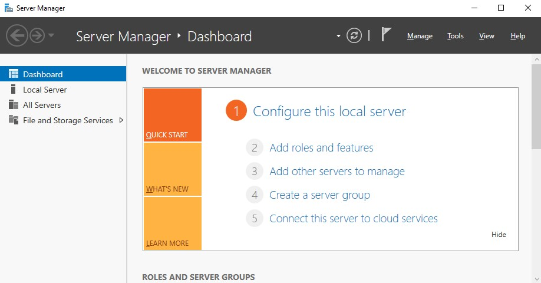
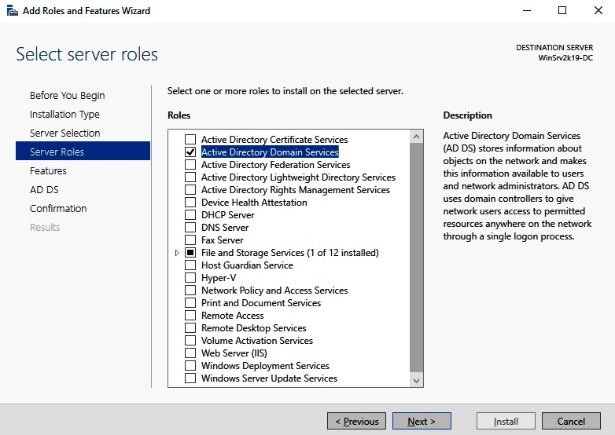
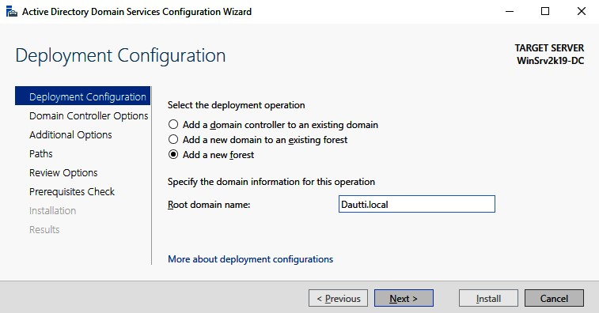

>   **Chapter 5 exercise – installing the AD DS and DNS roles and promoting the
>   server to a DC**

>   In this chapter exercise, you will learn how to install the AD DS and DNS
>   roles and promote the server to a DC.

**Installing the AD DS and DNS roles, and**

promoting the server to a DC
----------------------------

>   To install the AD DS role in Windows Server 2019, complete the following
>   steps:

1.  Start LON-DC! And LON-DC2.

2.  Sign in to LON-DC1 with myorg\\administrator and Pa55w.rd

3.  Click the **Start** button, and then, in the **Start** menu, click the
    **Server Manager** tile.

4.  In the **Server Manager** window, in the **WELCOME TO SERVER MANAGER**
    section, click **Add roles and features**, as shown in *Figure 5.27*:

1.  With the **Add Roles and Features Wizard** open, click **Next**.

2.  Select the **Role-based or feature-based installation** option and click
    **Next**.

3.  With the **Select a server from the server pool** option checked, click
    **Next**.

4.  Select the **Active Directory Domain Services** role, as shown in *Figure
    5.28*, and then click **Next**:

1.  Click the **Add Features** button when the **Add features that are required
    for Active Directory Domain Services?** window is displayed. Click **Next**.

2.  Accept the default settings in the **Select features** step and click
    **Next**.

3.  Take your time to read the AD DS description and the things to note
    regarding AD DS installation. Then, click **Next**.

4.  Confirm the installation selections for the AD DS role and click the
    **Install** button.

5.  Either hit **Close** or wait until the installation progress reaches its
    end.

6.  Click **Close** to close the **Add Roles and Features Wizard***.*

7.  In **Notifications**, click **Promote this server to a domain controller**.

8.  In the AD DS configuration wizard*,* select the **Add a domain controller to
    an existing domain** option, as shown in *Figure 5.29*, and then check that
    the domain is set to myorg.local. Click **Next**:

1.  Accept the defaults for the extra roles (DNS) and setings (Global Catalog),
    and set the **Directory Services Restore Mode** (**DSRM**) password to
    Pa55w.rd. Click **Next** 5 times.

2.  Since the prerequisites are met, click **Install**.

3.  The server will restart to complete promoting itself to a DC.

4.  After restart, sign in to LON-DC2 with myorg\\administrator and Pa55w.rd,
    open Active Directory Users and Computers and verify that the users and
    groups are replicated to LON-DC2
