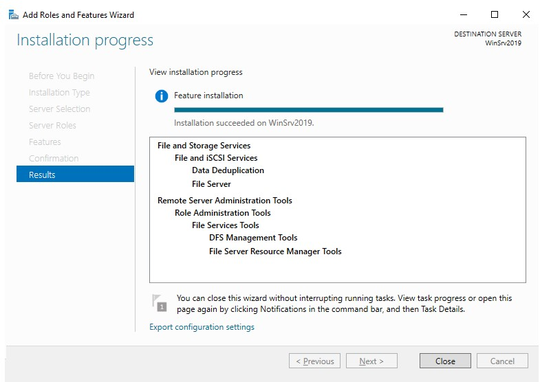

>   **Chapter 9 exercise – enabling dedup on Windows Server 2019**

>   In this chapter's exercise, you will learn how to enable dedup on Windows
>   Server 2019.

Enabling dedup on Windows Server 2019
-------------------------------------

>   To enable dedup in Windows Server 2019, complete the following steps:

1.  Click **Add roles and features** within the **Server Manager** \| **WELCOME
    TO SERVER MANAGER** section.

2.  On the **Before You Begin** window, click **Next.**

3.  Click **Next** on the **Installation Type** window.

4.  On the **Server Selection** window, click **Next.**

5.  On the **Server Roles** window, expand **File and Storage Services.**

6.  Then, expand **File and iSCSI Services.**

7.  Select **Data Deduplication**, as shown in *Figure 9.7*.

8.  On the **Features** window, click **Next.**

9.  On the **Confirmation** window, click **Install.**

10. When you see the installation has completed, click **Close**, as shown in
    *Figure 9.19*:

>   This exercise has shown us how dedup can be installed on Windows Server
>   2019.
